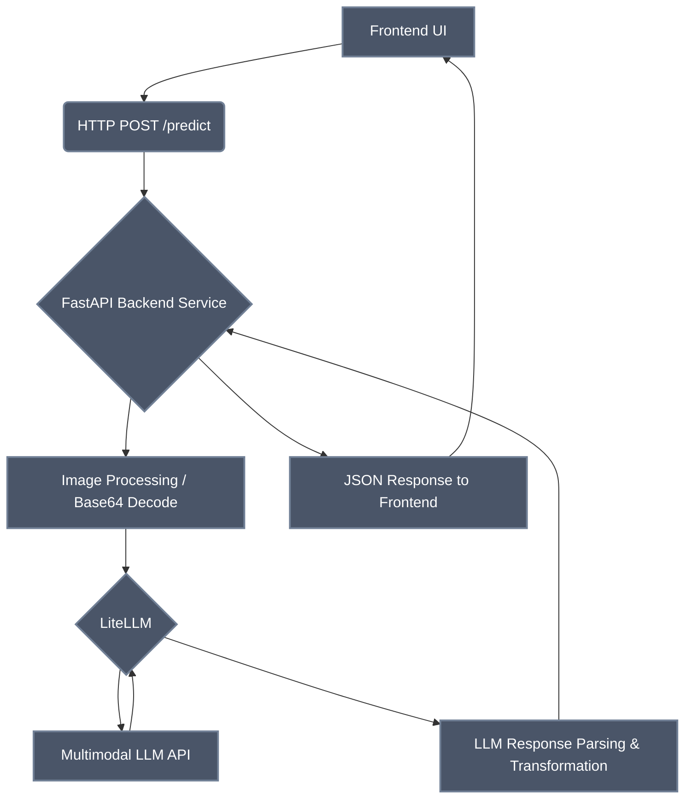

# Task 2 Core Design

## Architecture Diagram

```mermaid
graph TD
    A[Frontend UI] --> B("HTTP POST /predict")
    B --> C{FastAPI Backend Service}
    C --> D[Image Processing / Base64 Decode]
    D --> E{LiteLLM}
    E --> F[Multimodal LLM API]
    F --> E
    E --> G[LLM Response Parsing & Transformation]
    G --> C
    C --> H[JSON Response to Frontend]
    H --> A


    style A fill:#4a5568,stroke:#718096,stroke-width:2px,color:#ffffff
    style B fill:#4a5568,stroke:#718096,stroke-width:2px,color:#ffffff
    style C fill:#4a5568,stroke:#718096,stroke-width:2px,color:#ffffff
    style D fill:#4a5568,stroke:#718096,stroke-width:2px,color:#ffffff
    style E fill:#4a5568,stroke:#718096,stroke-width:2px,color:#ffffff
    style F fill:#4a5568,stroke:#718096,stroke-width:2px,color:#ffffff
    style G fill:#4a5568,stroke:#718096,stroke-width:2px,color:#ffffff
    style H fill:#4a5568,stroke:#718096,stroke-width:2px,color:#ffffff
    
    classDef default fill:#2d3748,stroke:#4a5568,stroke-width:2px,color:#ffffff
``` 