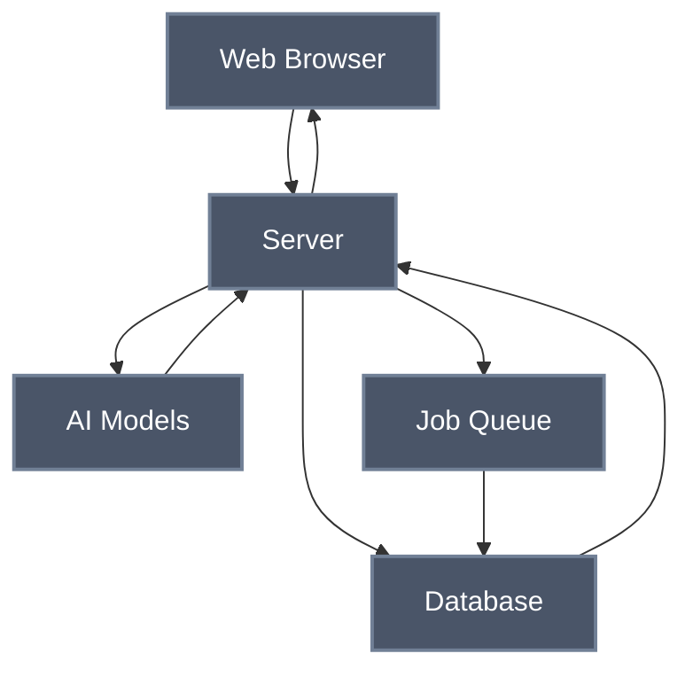

# Task 2 Scale Design

## Overview
Simplified, scalable architecture for the image annotation system using AI models.

## Architecture Diagram



## Components

### 🌐 Web Browser
- User interface for image upload and results display
- Real-time progress updates

### 🖥️ Server
- Central application server
- Handles HTTP requests, image processing, job management
- Coordinates with AI models and database
- Real-time updates via WebSocket

### 🤖 AI Models
- External AI services (GPT-4V, Claude Vision, etc.)
- Multi-provider support via LiteLLM

### 📋 Job Queue
- Manages batch processing jobs
- Redis-based with retry mechanisms

### 💾 Database
- Stores job status, results, user data

## API Endpoints

### Single Image
```http
POST /api/v1/predict
→ Returns prediction immediately
```

### Batch Processing
```http
POST /api/v1/batch-predict
→ Returns job_id

GET /api/v1/jobs/{job_id}/status
→ Returns progress

GET /api/v1/jobs/{job_id}/results
→ Returns results
```

## Data Flow

### **Single Image**
Browser → Server → AI Models → Server → Browser

### **Batch Processing**
Browser → Server → Job Queue → Background Processing → Database
Real-time updates via WebSocket
